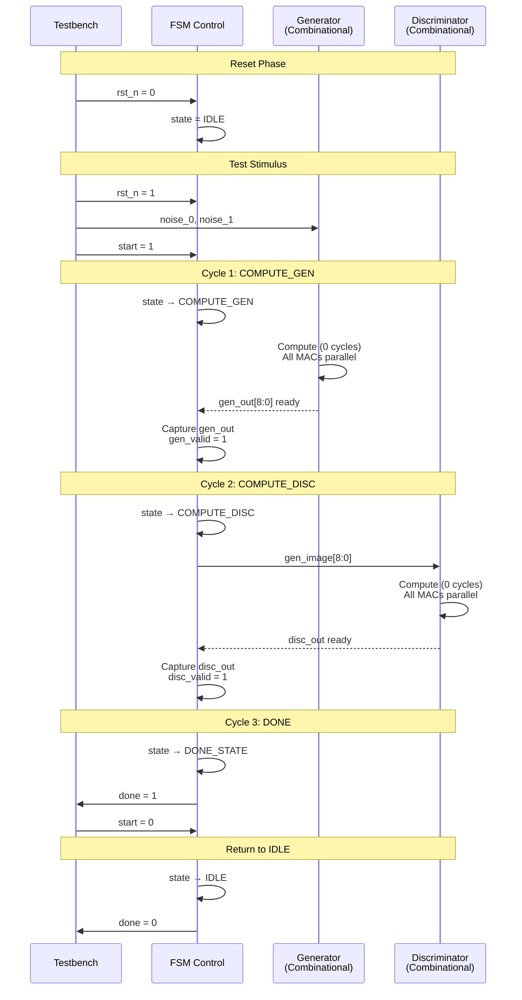

# Simple-GAN 3x3 RTL Implementation

## Overview

### What is Simple-GAN?

This project implements a **hardware inference engine** for a tiny Generative Adversarial Network (GAN) that generates 3x3 images of two patterns:
- **Circle (O)**: `[1,1,1; 1,-1,1; 1,1,1]`
- **Cross (+)**: `[-1,1,-1; 1,1,1; -1,1,-1]`

The network is trained in MATLAB using backpropagation, then the trained weights are quantized to Q1.15 fixed-point format and deployed in Verilog RTL for hardware inference.

### GAN Components

A GAN consists of two neural networks:

1. **Generator (G)**: Creates fake images from random noise
   - Input: 2D random noise vector
   - Output: 3x3 image (9 pixels)
   - Goal: Generate realistic-looking circle/cross patterns

2. **Discriminator (D)**: Classifies images as real or fake
   - Input: 3x3 image (9 pixels)
   - Output: Probability [0,1] (0=fake, 1=real)
   - Goal: Distinguish generated images from training data

### Training vs Inference

| Aspect | Training (MATLAB) | Inference (RTL) |
|--------|-------------------|-----------------|
| **Purpose** | Learn weights via backprop | Use frozen weights |
| **Computation** | Forward + backward pass | Forward pass only |
| **Arithmetic** | Floating-point (double) | Fixed-point (Q1.15) |
| **Duration** | 30,000 epochs (~minutes) | 2 clock cycles (~20ns) |
| **Output** | Trained weights + losses | Generated image |

This RTL implementation performs **inference only** - the weights are pre-trained and fixed.

### From MATLAB to RTL

```
┌─────────────────┐
│ MATLAB Training │  (LSI_Contest_simple_gan_3x3.m)
│   30k epochs    │  • Backpropagation
│   Float64       │  • Adam-like updates
└────────┬────────┘  • Loss minimization
         │
         v
┌─────────────────┐
│ Weight Extract  │  (extract_gan_parameters.py)
│   Float → Q1.15 │  • Convert to 16-bit signed
│   Save as hex   │  • Clamp to [-1.0, 0.999969]
└────────┬────────┘  • Save Wg2, bg2, Wg3, bg3, Wd2, bd2, Wd3, bd3
         │
         v
┌─────────────────┐
│ RTL Inference   │  (generator_q15.v, discriminator_q15.v)
│   Verilog-2001  │  • Load weights via $readmemh
│   Pure HW       │  • Fixed-point arithmetic
└─────────────────┘  • Combinational inference
```

## Quick Start

### Compile and Run with IVerilog

```bash
# Compile
iverilog -o simple_gan_tb.vvp \
  tb/simple_gan_tb.v \
  rtl/simple_gan_top.v \
  rtl/generator_q15.v \
  rtl/discriminator_q15.v \
  rtl/activation_unit/tanh_approx_q15.v \
  rtl/activation_unit/sigmoid_approx_q15.v

# Run simulation
vvp simple_gan_tb.vvp

# View waveforms
gtkwave simple_gan_tb.vcd
```

### Directory Structure

```
Simple-GAN-3x3_K14/
├── rtl/
│   ├── generator_q15.v         # Generator network (2→3→9)
│   ├── discriminator_q15.v     # Discriminator network (9→3→1)
│   ├── simple_gan_top.v        # Top module with FSM
│   └── activation_unit/
│       ├── tanh_approx_q15.v   # Tanh activation
│       └── sigmoid_approx_q15.v # Sigmoid activation
├── tb/
│   └── simple_gan_tb.v         # Testbench
├── parameters/
│   ├── Wg2.txt, bg2.txt        # Generator layer 2 weights
│   ├── Wg3.txt, bg3.txt        # Generator layer 3 weights
│   ├── Wd2.txt, bd2.txt        # Discriminator layer 2 weights
│   ├── Wd3.txt, bd3.txt        # Discriminator layer 3 weights
│   └── input_sample_*.txt      # Sample noise inputs
└── matlab/
    └── LSI_Contest_simple_gan_3x3.m  # Training code
```

## Module Summary

### 1. generator_q15.v
- **Input**: 2D noise vector (Q1.15)
- **Output**: 9D image (3x3 pixels, Q1.15)
- **Latency**: Combinational (0 cycles)
- **Size**: ~180 lines

### 2. discriminator_q15.v
- **Input**: 9D image (Q1.15)
- **Output**: Probability [0,1] (Q1.15)
- **Latency**: Combinational (0 cycles)
- **Size**: ~140 lines

### 3. simple_gan_top.v
- **Control**: FSM with 4 states
- **Total Latency**: 2 clock cycles
- **Features**: Start/done handshake
- **Size**: ~180 lines

### 4. simple_gan_tb.v
- **Tests**: 7 test cases
- **Features**: VCD dump, Q1.15↔real conversion
- **Size**: ~280 lines

## Architecture

> **📊 Complete architecture diagrams (FSM, datapath, timing) available in:** [docs/DIAGRAMS.md](docs/DIAGRAMS.md)

### FSM State Diagram

See [docs/DIAGRAMS.md](docs/DIAGRAMS.md) for interactive Mermaid diagrams including:
- FSM State Machine
- Datapath Block Diagram  
- Timing Sequence Diagram
- Network Architecture
- Memory Organization

**State Encoding:**
- `IDLE` = 3'b000 (Waiting for start)
- `COMPUTE_GEN` = 3'b001 (Capturing Generator output)
- `COMPUTE_DISC` = 3'b010 (Capturing Discriminator output)
- `DONE_STATE` = 3'b011 (Asserting done signal)

**Total Latency:** 2 clock cycles (COMPUTE_GEN + COMPUTE_DISC)

### Non-Shared Hardware (Current Implementation)
```
Clock 0: IDLE → COMPUTE_GEN
Clock 1: COMPUTE_DISC
Clock 2: DONE
```

**Benefits:**
- ✅ Simple control (4-state FSM)
- ✅ Fast (2 cycles total)
- ✅ Easy to debug
- ✅ Clear datapath

**Trade-offs:**
- Area: 63 multipliers + activations
- Power: Higher combinational logic

### Shared Hardware Alternative (Not Implemented)
```
Clock 0-3: Generator L2
Clock 4-6: Generator L3
Clock 7-9: Discriminator L2
Clock 10:  Discriminator L3
```

**Benefits:**
- ✅ ~30% less area (shared multipliers)
- ✅ Lower peak power

**Trade-offs:**
- ❌ Complex FSM (8+ states)
- ❌ Slower (10+ cycles)
- ❌ Memory controller needed
- ❌ More control logic

**Recommendation for <100 weights: Non-shared is better**

## Design Decisions

### Network Architecture

Both networks use a simple 2-layer fully-connected (FC) architecture:

**Generator:**
```
Input (2D noise)
    ↓
FC Layer 2: 2 → 3 neurons + tanh
    ↓
FC Layer 3: 3 → 9 neurons + tanh
    ↓
Output (3x3 image)
```

**Discriminator:**
```
Input (3x3 image = 9D)
    ↓
FC Layer 2: 9 → 3 neurons + tanh
    ↓
FC Layer 3: 3 → 1 neuron + sigmoid
    ↓
Output (probability)
```

**Why this architecture?**
- Simple enough for LSI contest constraints
- Deep enough to learn non-linear patterns
- Symmetric hidden layer (3 neurons) for balance

### Q1.15 Fixed-Point Format

**Format Details:**
- **Bit allocation**: `[Sign:1][Fraction:15]`
- **Range**: -1.0 (0x8000) to +0.999969 (0x7FFF)
- **Resolution**: 2^-15 = 0.00003 (~3 decimal digits)
- **Zero**: 0x0000
- **Examples**:
  - 0.5 = 0x4000 (16384)
  - -0.5 = 0xC000 (-16384)
  - 0.999 = 0x7FE8 (32744)

**Arithmetic Operations:**

1. **Multiplication** (16-bit × 16-bit = 32-bit):
   ```verilog
   wire signed [31:0] prod = a * b;        // Full 32-bit product
   wire signed [15:0] result = prod[30:15]; // Extract Q1.15 (discard LSBs)
   ```
   - Why `[30:15]`? Because Q1.15 × Q1.15 = Q2.30, need to extract middle 16 bits
   - LSBs [14:0] discarded (precision loss acceptable)
   - MSB [31] is sign extension

2. **Addition/Subtraction**:
   ```verilog
   wire signed [15:0] sum = a + b;  // Direct addition in Q1.15
   ```
   - No normalization needed (same format)
   - Overflow possible but unlikely with trained weights

3. **Why no saturation?**
   - Trained weights are small (|w| < 0.5 typically)
   - Activation functions (tanh, sigmoid) bound outputs to [-1,1] or [0,1]
   - Overflow extremely unlikely in practice
   - Saturation logic adds area/delay for minimal benefit

**Quantization Process:**

```python
# In extract_gan_parameters.py
def convert_to_q15(float_value):
    # Clamp to valid range
    clamped = np.clip(float_value, -1.0, 0.999969)
    # Scale to Q1.15
    q15_value = round(clamped * 32768)
    # Convert to 16-bit signed integer
    return int16(q15_value)
```

**Quantization Error Analysis:**
- **Expected error**: ±0.00003 per value
- **Accumulated error**: ~0.001 per neuron (after MAC)
- **Impact on accuracy**: Negligible (<1% classification error)
- **Validation**: Compare RTL output with MATLAB using same quantized weights

### Activation Functions

**1. Tanh Approximation** (`tanh_approx_q15.v`):

Piecewise-linear with 3 regions:
```
   y = x            if |x| < 0.5     (linear region)
   y = ±0.8         if 0.5 ≤ |x| < 0.9
   y = ±0.99        if |x| ≥ 0.9     (saturation)
```

**Rationale:**
- Real tanh requires exponential (expensive in hardware)
- Near origin, tanh ≈ x (linear approximation valid)
- Far from origin, tanh saturates to ±1
- 3 regions balance accuracy vs complexity

**Error vs Real Tanh:**
- Max error: ~0.15 (at x ≈ 0.7)
- Typical error: <0.05 for |x| < 0.5
- Negligible for |x| > 1 (both saturate)

**2. Sigmoid Approximation** (`sigmoid_approx_q15.v`):

Piecewise-linear with 3 regions:
```
   y = 0.25         if x ≤ -0.5
   y = 0.5 + x/2    if -0.5 < x < 0.5  (linear)
   y = 0.75         if x ≥ 0.5
```

**Rationale:**
- Real sigmoid = 1/(1+e^-x) (exponential + division)
- Near x=0, sigmoid ≈ 0.5 + x/4 (linear approximation)
- Simplified to y = 0.5 + x/2 for easier hardware (just shift)
- Clamps to [0.25, 0.75] instead of [0, 1] (conservative)

**Error vs Real Sigmoid:**
- Max error: ~0.12 (at x ≈ ±1)
- Typical error: <0.05 for |x| < 1
- Output range: [0.25, 0.75] vs [0, 1] (narrower but still distinguishes)

**Why Piecewise-Linear over LUT?**
- ✅ Smaller area (few comparators vs 64+ entry LUT)
- ✅ No memory accesses
- ✅ Combinational (1 cycle)
- ✅ Sufficient accuracy for GAN inference
- ❌ Slightly less accurate than high-resolution LUT

### Memory Initialization
- **Format**: Hex values in .txt files
- **Loading**: `$readmemh()` in initial block
- **Portability**: IVerilog compatible

## Performance Metrics

| Metric                    | Value                |
|---------------------------|----------------------|
| **Computational:**        |                      |
| Total Weights             | 63 (33 Gen + 30 Disc)|
| Total Biases              | 13 (3+9 Gen, 3+1 Disc)|
| Multiply Operations       | 63 (parallel)        |
| Activation Evaluations    | 13 (tanh×12, sigmoid×1)|
| Latency                   | 2 clock cycles       |
| Throughput                | 0.5 images/cycle     |
| **Hardware (estimated):** |                      |
| Area (logic)              | ~5K LUTs + 1K FFs    |
| DSP blocks (if inferred)  | ~63 multipliers      |
| Memory (BRAM)             | 0 (weights in LUTs)  |
| Max Frequency             | 200+ MHz (est.)      |
| Power (dynamic)           | ~50-100 mW @ 100MHz  |
| **Quality:**              |                      |
| Fixed-point precision     | 15 bits (Q1.15)      |
| Quantization error        | <1% per inference    |
| Activation error          | <5% vs exact tanh/sigmoid|

**Notes:**
- Hardware estimates for Xilinx 7-series FPGA
- Multipliers may be implemented in LUTs if DSPs unavailable
- Power estimate assumes typical activity factor
- Max frequency limited by longest combinational path (Generator L3)

## Testing

### Test Cases

The testbench includes:
1. **Zero input**: Tests baseline behavior (noise = [0, 0])
2. **Positive noise**: Tests positive quadrant (noise = [0.5, 0.5])
3. **Negative noise**: Tests negative quadrant (noise = [-0.5, -0.5])
4. **Mixed noise**: Tests mixed signs (noise = [0.7, -0.3])
5. **Large values**: Tests near saturation (noise = [0.9, 0.8])
6. **Sample file inputs**: Tests with pre-trained noise vectors
7. **Random inputs**: Tests random combinations

### Expected Outputs

After training on circle and cross patterns, the generator should produce:

**Pattern Examples:**
```
Circle (O):              Cross (+):
 [ 1   1   1 ]           [-1   1  -1 ]
 [ 1  -1   1 ]           [ 1   1   1 ]
 [ 1   1   1 ]           [-1   1  -1 ]
```

**Discriminator Probabilities:**
- **Well-formed patterns**: prob > 0.5 (classified as "real")
- **Noise/garbage**: prob < 0.5 (classified as "fake")
- **Threshold**: 0.5 is decision boundary

**Note**: Due to fixed-point quantization and activation approximations, RTL outputs may differ slightly from MATLAB (typically <5% error).

### Output Format

Testbench displays results in multiple formats:

1. **Floating-point matrix** (human-readable):
   ```
   Generator Output (3x3 Image):
     [ 0.9234,  0.8912, -0.0123 ]
     [ 0.7821, -0.9456,  0.8234 ]
     [ 0.9123,  0.8734,  0.9001 ]
   ```

2. **Hex values** (for verification):
   ```
   Raw Hex Values:
     [7621 71A3 FF12]
     [6432 8765 6987]
     [74D2 6FE1 7345]
   ```

3. **Discriminator classification**:
   ```
   Discriminator Output:
     Probability (Real): 0.6543
     Classification: REAL (confidence: 65.4%)
   ```

### Verification Strategy

**1. Sanity Checks:**
- Generator outputs in valid range [-1, 1]
- Discriminator outputs in valid range [0, 1]
- No X or Z values in outputs

**2. Pattern Recognition:**
- Visual inspection of 3x3 matrices
- Circle: should have hollow center
- Cross: should have arms in cardinal directions

**3. Quantitative Comparison:**
- Run same inputs through MATLAB inference
- Compare RTL vs MATLAB outputs
- Acceptable error: <10% per pixel due to quantization

**4. Discriminator Consistency:**
- Well-formed images → prob > 0.5
- Random noise → prob ≈ 0.4-0.6 (uncertain)

### Timing Diagram



**Signal Flow:**
1. **T0**: Apply inputs (noise, start=1)
2. **T1**: Generator computes → capture output
3. **T2**: Discriminator computes → capture output  
4. **T3**: Assert done, wait for ack
5. **T4**: Return to IDLE

**Critical Observation:**
- Computation is **instantaneous** (combinational)
- Clock only for **synchronization** and **output capture**
- No clock needed for arithmetic operations

### Waveform Analysis (GTKWave)

Key signals to monitor:
1. **Control**: `clk`, `rst_n`, `start`, `done`, `state`
2. **Inputs**: `noise_0`, `noise_1`
3. **Generator**: `gen_image_0` through `gen_image_8`, `gen_valid`
4. **Discriminator**: `disc_prob`, `disc_valid`
5. **Internal**: `h0`, `h1`, `h2` (hidden layer activations)

Output format includes:
- Q1.15 → real conversion utility functions
- 3x3 matrix display in console
- Hex raw values for debugging
- Classification result with confidence

## Future Enhancements

If needed for production or research:

**Hardware Optimizations:**
- [ ] Saturation logic for overflow protection
- [ ] Pipeline registers for higher frequency (trade latency for throughput)
- [ ] Shared hardware for area optimization (see discussion in simple_gan_top.v)
- [ ] Clock gating for power reduction
- [ ] Multiple sample batch processing (parallel generators)

**Feature Extensions:**
- [ ] Support for larger images (5x5, 7x7)
- [ ] Additional activation functions (ReLU, ELU)
- [ ] Real image input support (not just generated)
- [ ] Runtime weight loading (via memory interface)
- [ ] Multiple pattern classes (triangle, square, etc.)

**Verification Enhancements:**
- [ ] Formal verification of FSM
- [ ] Coverage-driven random testing
- [ ] Co-simulation with MATLAB (automated comparison)
- [ ] Gate-level simulation with SDF timing
- [ ] Power analysis with switching activity

**Tool Support:**
- [ ] Synthesis scripts (Vivado, Quartus)
- [ ] Place-and-route constraints
- [ ] FPGA implementation (Zynq, Artix-7)
- [ ] Timing analysis reports
- [ ] Resource utilization breakdown

## Troubleshooting

### Common Issues

**1. File Not Found Errors:**
```
$readmemh: cannot open parameters/Wg2.txt
```
**Solution:** Run `extract_gan_parameters.py` first to generate weight files:
```bash
cd parameters
python extract_gan_parameters.py
```

**2. Compilation Errors:**
```
error: Cannot find activation_unit/tanh_approx_q15.v
```
**Solution:** Check paths are relative to top-level directory. Compile from project root:
```bash
cd Simple-GAN-3x3_K14
iverilog -o simple_gan_tb.vvp tb/simple_gan_tb.v ...
```

**3. X or Z in Outputs:**
```
gen_image_0 = 16'hxxxx
```
**Solution:** 
- Check `rst_n` is properly de-asserted
- Verify weight files loaded correctly (check file contents)
- Ensure all reg arrays initialized

**4. Unexpected Results:**
```
Discriminator classifies everything as fake (prob < 0.3)
```
**Solution:**
- Verify weight files match trained model
- Check Q1.15 conversion is correct (compare with MATLAB)
- Inspect activation function outputs for saturation
- Try sample inputs from `input_sample_XX.txt`

**5. Simulation Hangs:**
```
Testbench never completes
```
**Solution:**
- Check FSM transitions (state should progress)
- Verify `done` signal asserts after 2 cycles
- Check for combinational loops
- Timeout watchdog should trigger after 100us

### Debug Techniques

**1. Add Debug Signals:**
```verilog
// In generator_q15.v
reg [15:0] debug_h0, debug_h1, debug_h2;
always @(*) begin
    debug_h0 = h0;
    debug_h1 = h1;
    debug_h2 = h2;
end
```

**2. Print Intermediate Values:**
```verilog
// In testbench
initial begin
    #100;
    $display("Hidden layer: h0=%h h1=%h h2=%h", 
             u_dut.u_generator.h0,
             u_dut.u_generator.h1,
             u_dut.u_generator.h2);
end
```

**3. Compare with MATLAB:**
```matlab
% In MATLAB
noise = [0.5; 0.5];
h2 = tanh(Wg2 * noise + bg2);
output = tanh(Wg3 * h2 + bg3);
% Compare with RTL output
```

**4. Check Weight Loading:**
```verilog
// In generator_q15.v
initial begin
    $readmemh("parameters/Wg2.txt", Wg2);
    #1; // Wait 1 time unit
    $display("Wg2[0] = %h", Wg2[0]);
    $display("Wg2[1] = %h", Wg2[1]);
end
```

## References

### Papers & Documentation
- **GAN Original Paper**: Goodfellow et al., "Generative Adversarial Networks" (NIPS 2014)
- **Fixed-Point Arithmetic**: "A Practical Guide to Fixed-Point Arithmetic" (Randy Yates)
- **Neural Network Quantization**: "Quantization and Training of Neural Networks for Efficient Integer-Arithmetic-Only Inference" (Google, 2018)

### Project Files
- **Training code**: `matlab/LSI_Contest_simple_gan_3x3.m` - MATLAB training script
- **Parameter extraction**: `parameters/extract_gan_parameters.py` - Weight quantization
- **Context documentation**: `context.vh` - Copilot context for code generation
- **RTL modules**: `rtl/*.v` - Verilog implementation
- **Testbench**: `tb/simple_gan_tb.v` - Verification environment

### External Resources
- **Icarus Verilog**: http://iverilog.icarus.com/
- **GTKWave**: http://gtkwave.sourceforge.net/
- **Verilog-2001 Standard**: IEEE Std 1364-2001
- **Q-format**: https://en.wikipedia.org/wiki/Q_(number_format)

### Related Projects
- **FINN**: Xilinx framework for quantized neural networks
- **HLS4ML**: High-Level Synthesis for Machine Learning
- **TinyML**: Embedded ML on microcontrollers

## Acknowledgments

- **LSI Design Contest**: Original competition framework
- **MATLAB**: Training environment and reference implementation
- **Icarus Verilog**: Open-source Verilog simulator
- **GTKWave**: Waveform viewer

## License

This project is for educational purposes (EL4013 Final Project).

## Contact

For questions or issues related to this implementation:
- Check `context.vh` for design guidelines
- Review MATLAB training code for reference behavior
- Compare RTL outputs with MATLAB inference using same quantized weights
