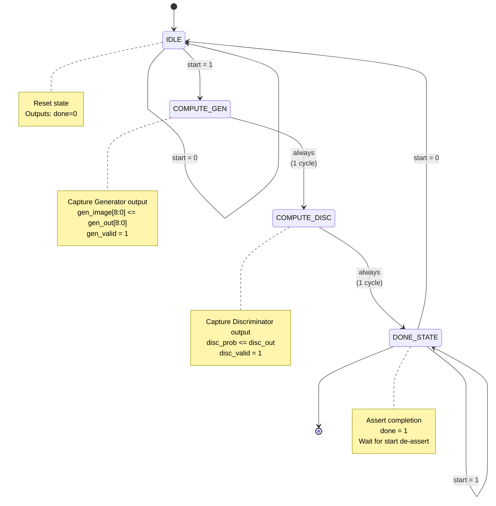
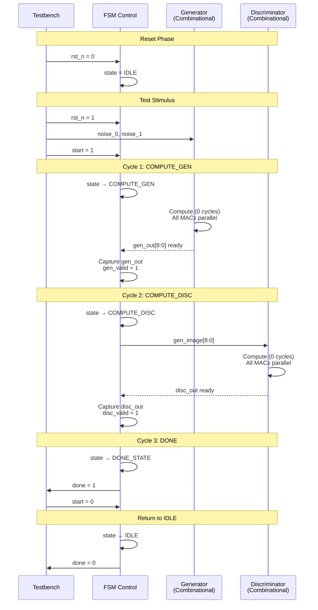
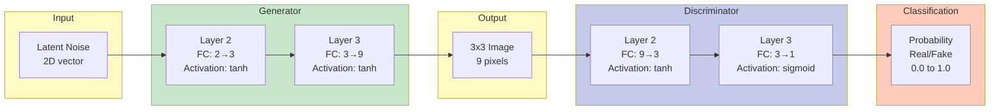
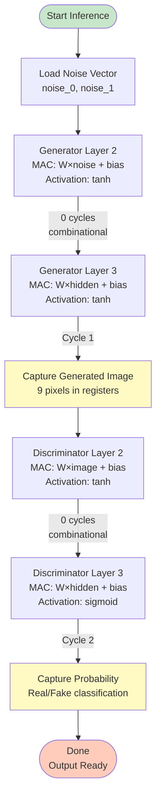
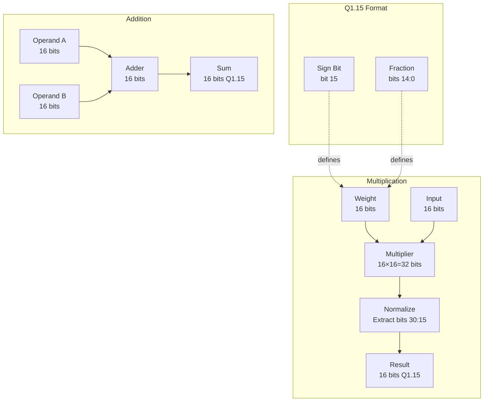

# Simple-GAN Architecture Diagrams

This document contains all architectural diagrams for the Simple-GAN 3x3 RTL implementation using Mermaid syntax.

---

## 1. FSM State Diagram



**State Encoding:**
- `IDLE` = 3'b000
- `COMPUTE_GEN` = 3'b001
- `COMPUTE_DISC` = 3'b010
- `DONE_STATE` = 3'b011

**Total Latency:** 2 clock cycles (COMPUTE_GEN + COMPUTE_DISC)

---

## 2. Datapath Block Diagram

```mermaid
graph TB
    subgraph Inputs
        N0[noise_0<br/>16-bit Q1.15]
        N1[noise_1<br/>16-bit Q1.15]
    end
    
    subgraph Generator["Generator (Combinational)"]
        subgraph GenL2["Layer 2: FC(2→3) + tanh"]
            WG2[Wg2 ROM<br/>6 weights]
            BG2[bg2 ROM<br/>3 biases]
            MAC2[6 Multipliers<br/>6 Adders]
            TANH2[3× tanh_approx]
            H[h0, h1, h2<br/>Hidden Layer]
        end
        
        subgraph GenL3["Layer 3: FC(3→9) + tanh"]
            WG3[Wg3 ROM<br/>27 weights]
            BG3[bg3 ROM<br/>9 biases]
            MAC3[27 Multipliers<br/>27 Adders]
            TANH3[9× tanh_approx]
            IMG[image_0..8<br/>3x3 pixels]
        end
    end
    
    subgraph Discriminator["Discriminator (Combinational)"]
        subgraph DiscL2["Layer 2: FC(9→3) + tanh"]
            WD2[Wd2 ROM<br/>27 weights]
            BD2[bd2 ROM<br/>3 biases]
            MAC4[27 Multipliers<br/>27 Adders]
            TANH4[3× tanh_approx]
            DH[d_h0, d_h1, d_h2]
        end
        
        subgraph DiscL3["Layer 3: FC(3→1) + sigmoid"]
            WD3[Wd3 ROM<br/>3 weights]
            BD3[bd3 ROM<br/>1 bias]
            MAC5[3 Multipliers<br/>3 Adders]
            SIG[sigmoid_approx]
            PROB[prob<br/>Real/Fake]
        end
    end
    
    subgraph Control["FSM Control (Sequential)"]
        FSM[Simple FSM<br/>4 States]
        REG1[Output Registers<br/>gen_image[8:0]]
        REG2[Output Register<br/>disc_prob]
    end
    
    N0 --> MAC2
    N1 --> MAC2
    WG2 --> MAC2
    BG2 --> MAC2
    MAC2 --> TANH2
    TANH2 --> H
    
    H --> MAC3
    WG3 --> MAC3
    BG3 --> MAC3
    MAC3 --> TANH3
    TANH3 --> IMG
    
    IMG --> REG1
    REG1 --> MAC4
    WD2 --> MAC4
    BD2 --> MAC4
    MAC4 --> TANH4
    TANH4 --> DH
    
    DH --> MAC5
    WD3 --> MAC5
    BD3 --> MAC5
    MAC5 --> SIG
    SIG --> PROB
    
    PROB --> REG2
    
    FSM -.controls.-> REG1
    FSM -.controls.-> REG2
    
    style Generator fill:#e1f5e1
    style Discriminator fill:#e1e5f5
    style Control fill:#f5e1e1
    style GenL2 fill:#c8e6c9
    style GenL3 fill:#c8e6c9
    style DiscL2 fill:#c5cae9
    style DiscL3 fill:#c5cae9
```

**Key Points:**
- Generator and Discriminator are **fully parallel** (all MACs execute simultaneously)
- **No pipeline registers** between layers (pure combinational)
- FSM only controls **when to capture** outputs (not computation)
- Total hardware: **63 multipliers + 80 adders + 13 activations**

---

## 3. Timing Sequence Diagram



**Signal Flow:**
1. **T0**: Apply inputs (noise, start=1)
2. **T1**: Generator computes → capture output
3. **T2**: Discriminator computes → capture output  
4. **T3**: Assert done, wait for ack
5. **T4**: Return to IDLE

**Critical Observation:**
- Computation is **instantaneous** (combinational)
- Clock only for **synchronization** and **output capture**
- No clock needed for arithmetic operations

---

## 4. Network Architecture



**Network Parameters:**
- **Generator**: 33 weights (6 + 27) + 12 biases (3 + 9)
- **Discriminator**: 30 weights (27 + 3) + 4 biases (3 + 1)
- **Total**: 63 weights + 16 biases = 79 parameters

---

## 5. Memory Organization

```mermaid
graph TD
    subgraph "Weight Memory (ROM)"
        WG2[Wg2<br/>3x2 = 6 weights<br/>96 bits]
        BG2[bg2<br/>3 biases<br/>48 bits]
        WG3[Wg3<br/>9x3 = 27 weights<br/>432 bits]
        BG3[bg3<br/>9 biases<br/>144 bits]
        WD2[Wd2<br/>3x9 = 27 weights<br/>432 bits]
        BD2[bd2<br/>3 biases<br/>48 bits]
        WD3[Wd3<br/>1x3 = 3 weights<br/>48 bits]
        BD3[bd3<br/>1 bias<br/>16 bits]
    end
    
    subgraph "Generator Datapath"
        GL2[Layer 2<br/>MAC Units]
        GL3[Layer 3<br/>MAC Units]
    end
    
    subgraph "Discriminator Datapath"
        DL2[Layer 2<br/>MAC Units]
        DL3[Layer 3<br/>MAC Units]
    end
    
    WG2 --> GL2
    BG2 --> GL2
    WG3 --> GL3
    BG3 --> GL3
    
    WD2 --> DL2
    BD2 --> DL2
    WD3 --> DL3
    BD3 --> DL3
    
    style "Weight Memory (ROM)" fill:#ffe0b2
```

**Total Memory:**
- Generator: 720 bits (90 bytes)
- Discriminator: 544 bits (68 bytes)
- **Grand Total**: 1264 bits (158 bytes)

**Implementation:**
- Stored as distributed RAM (LUTs) in FPGA
- Initialized via `$readmemh` from hex files
- Read-only after initialization

---

## 6. Data Flow (Single Inference)



**Execution Timeline:**
- **Cycle 0**: Load inputs
- **Cycle 1**: Generator computes + capture
- **Cycle 2**: Discriminator computes + capture
- **Cycle 3**: Done signal asserted

---

## 7. Fixed-Point Arithmetic



**Key Operations:**
1. **Multiply**: `prod[30:15] = (a * b) >> 15`
2. **Add**: Direct addition (same format)
3. **Range**: -1.0 (0x8000) to +0.999969 (0x7FFF)

---

## Usage

### View in GitHub
Simply open this file in GitHub - Mermaid diagrams will render automatically.

### View in VS Code
1. Install extension: "Markdown Preview Mermaid Support"
2. Press `Ctrl+Shift+V` to preview
3. Diagrams will render in preview pane

### Export to Images
```bash
# Install mermaid-cli
npm install -g @mermaid-js/mermaid-cli

# Generate PNG
mmdc -i DIAGRAMS.md -o diagram_fsm.png

# Generate SVG
mmdc -i DIAGRAMS.md -o diagram_fsm.svg
```

### Include in LaTeX
```bash
# Convert to PDF
mmdc -i DIAGRAMS.md -o diagrams.pdf

# Include in LaTeX
\includegraphics{diagrams.pdf}
```

---

## References

- Main README: [README_RTL.md](../README_RTL.md)
- FSM Documentation: [docs/FSM_DESIGN.md](FSM_DESIGN.md)
- RTL Source: [rtl/simple_gan_top.v](../rtl/simple_gan_top.v)
- Testbench: [tb/simple_gan_tb.v](../tb/simple_gan_tb.v)

---

## Revision History

| Version | Date | Changes |
|---------|------|---------|
| 1.0 | 2026-01-08 | Initial diagrams extracted from README |
