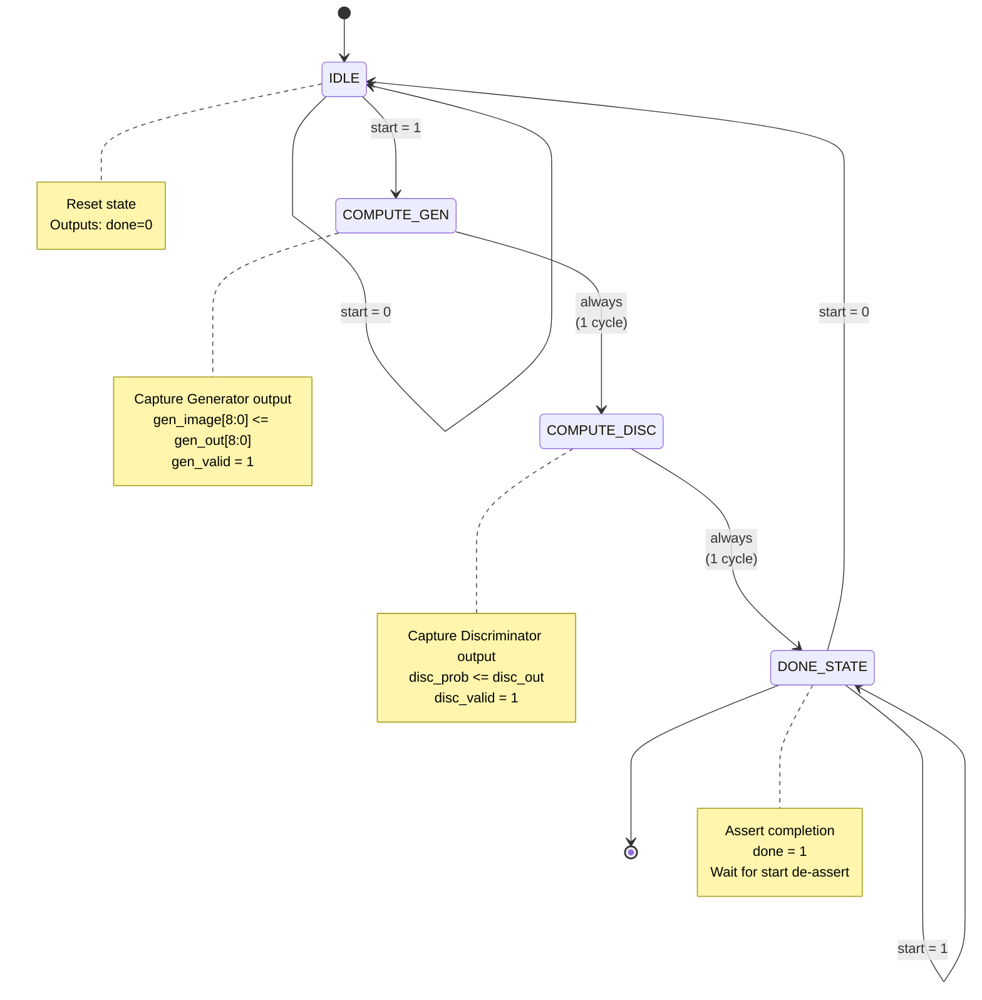

# Simple-GAN FSM Design Documentation

## Overview

The Simple-GAN hardware implementation uses a simple 4-state FSM to control the sequential capture of Generator and Discriminator outputs. The datapath itself is fully combinational (0 compute cycles), while the FSM provides synchronization and handshake protocol.

---

## State Machine Diagram



---

## State Encoding

| State Name | Encoding | Description |
|------------|----------|-------------|
| **IDLE** | `3'b000` | Waiting for start signal |
| **COMPUTE_GEN** | `3'b001` | Capturing Generator output |
| **COMPUTE_DISC** | `3'b010` | Capturing Discriminator output |
| **DONE_STATE** | `3'b011` | Asserting done, waiting for ack |

**Why 3 bits?**
- Only 4 states needed, but using 3 bits for future expansion
- Gray code not needed (simple sequential transitions)
- One-hot encoding not used (unnecessary for 4 states)

---

## State Transition Table

| Current State | Condition | Next State | Actions |
|---------------|-----------|------------|---------|
| **IDLE** | `start == 1` | COMPUTE_GEN | None |
| **IDLE** | `start == 0` | IDLE | `done = 0` |
| **COMPUTE_GEN** | Always | COMPUTE_DISC | Capture Generator output<br/>`gen_valid = 1` |
| **COMPUTE_DISC** | Always | DONE_STATE | Capture Discriminator output<br/>`disc_valid = 1` |
| **DONE_STATE** | `start == 1` | DONE_STATE | `done = 1` |
| **DONE_STATE** | `start == 0` | IDLE | `done = 0` |

---

## Timing Diagram

```
Clock Cycle:      0      1      2      3      4      5
                  │      │      │      │      │      │
clk            ───┘╲_────╲_────╲_────╲_────╲_────╲_────
                    │      │      │      │      │      │
start          ────────╱‾‾‾‾‾‾‾‾‾‾‾‾‾‾╲__________________
                    │      │      │      │      │      │
state          IDLE │ GEN  │ DISC │ DONE │ IDLE │ IDLE │
                    │      │      │      │      │      │
noise[1:0]     ════X══════════════════════════════════
                    │      │      │      │      │      │
gen_valid      ─────────╱‾‾‾‾‾╲_____________________________
                    │      │      │      │      │      │
disc_valid     ────────────────╱‾‾‾‾‾╲______________________
                    │      │      │      │      │      │
done           ───────────────────╱‾‾‾‾‾╲_________________
                    │      │      │      │      │      │
gen_image[8:0] ─────────X════════════════════════════════
                    │      │      │      │      │      │
disc_prob      ────────────────X═══════════════════════════

Legend:
  ╱ ╲  = Signal transition
  ═══  = Valid data
  ───  = Stable signal
  XXX  = Don't care / Invalid
```

**Key Observations:**
- Latency: **2 clock cycles** (GEN + DISC)
- Throughput: **1 inference / 3 cycles** (including done handshake)
- Efficiency: **66%** (2 productive cycles out of 3)

---

## Verilog Implementation

### State Register
```verilog
always @(posedge clk or negedge rst_n) begin
    if (!rst_n)
        state <= IDLE;
    else
        state <= next_state;
end
```

### Next State Logic
```verilog
always @(*) begin
    next_state = state;
    case (state)
        IDLE: begin
            if (start)
                next_state = COMPUTE_GEN;
        end
        
        COMPUTE_GEN: begin
            next_state = COMPUTE_DISC;
        end
        
        COMPUTE_DISC: begin
            next_state = DONE_STATE;
        end
        
        DONE_STATE: begin
            if (!start)
                next_state = IDLE;
        end
        
        default: next_state = IDLE;
    endcase
end
```

### Output Logic
```verilog
always @(posedge clk or negedge rst_n) begin
    if (!rst_n) begin
        gen_image_0 <= 16'h0;
        // ... initialize all outputs
        disc_prob   <= 16'h0;
        done        <= 1'b0;
        gen_valid   <= 1'b0;
        disc_valid  <= 1'b0;
    end else begin
        case (state)
            IDLE: begin
                done        <= 1'b0;
                gen_valid   <= 1'b0;
                disc_valid  <= 1'b0;
            end
            
            COMPUTE_GEN: begin
                gen_image_0 <= gen_out_0;
                // ... capture all 9 pixels
                gen_valid   <= 1'b1;
            end
            
            COMPUTE_DISC: begin
                disc_prob   <= disc_out;
                disc_valid  <= 1'b1;
            end
            
            DONE_STATE: begin
                done <= 1'b1;
            end
        endcase
    end
end
```

---

## Design Decisions

### Why Not Pipeline?

**Pipeline would look like:**
```
Cycle 1: Gen L2
Cycle 2: Gen L3
Cycle 3: Disc L2
Cycle 4: Disc L3
```

**Rejected because:**
- ❌ Network too small (only 4 layers total)
- ❌ Pipeline overhead > benefit (more registers than compute)
- ❌ No batch processing (single inference at a time)
- ✅ Combinational simpler and sufficient for this scale

### Why Not Shared Hardware?

**Shared would require:**
```
Cycle 1-3:   Compute Gen L2 (MAC loop)
Cycle 4-6:   Compute Gen L3 (MAC loop)
Cycle 7-9:   Compute Disc L2 (MAC loop)
Cycle 10-12: Compute Disc L3 (MAC loop)
Total: 12 cycles vs current 2 cycles
```

**Rejected because:**
- ❌ 6× slower (12 cycles vs 2)
- ❌ More complex FSM (8+ states vs 4)
- ❌ Need weight memory controller
- ❌ Minimal area savings (~30% for 6× slowdown)

### Why This Design?

**Current design benefits:**
- ✅ **Simple**: 4 states, easy to understand and debug
- ✅ **Fast**: 2 cycles total latency
- ✅ **Predictable**: Fixed timing, no dynamic behavior
- ✅ **Verifiable**: Clear separation of control and datapath
- ✅ **Scalable**: Easy to add pipeline if needed later

---

## Verification Strategy

### Functional Tests

1. **Basic Operation:**
   - Apply start → check state progression IDLE→GEN→DISC→DONE
   - Verify outputs captured correctly
   - Check done assertion

2. **Handshake Protocol:**
   - Start held high during DONE → FSM waits
   - Start de-asserted → FSM returns to IDLE
   - Multiple back-to-back inferences

3. **Reset Behavior:**
   - Async reset → immediate IDLE
   - All outputs cleared
   - No glitches on control signals

4. **Edge Cases:**
   - Start pulse too short (1 cycle)
   - Start de-asserted during computation
   - Reset during active computation

### Timing Verification

```verilog
// Check latency
initial begin
    @(posedge start);
    repeat(2) @(posedge clk);
    if (!done) $error("Done not asserted after 2 cycles");
end

// Check valid signals
always @(posedge clk) begin
    if (state == COMPUTE_GEN && !gen_valid)
        $error("gen_valid not asserted in COMPUTE_GEN");
    if (state == COMPUTE_DISC && !disc_valid)
        $error("disc_valid not asserted in COMPUTE_DISC");
end
```

---

## Performance Analysis

### Critical Path

**FSM Critical Path:**
```
CLK → FF(state) → Combinational Logic (next_state) → FF(state)
      └── 3-bit register
          └── 4-input mux (4 states)
              └── Comparator (start signal)
```

**Estimated Delay:**
- FF clock-to-Q: 0.2 ns
- Mux + comparator: 0.5 ns
- FF setup time: 0.2 ns
- **Total: 0.9 ns** → F_max > 1 GHz (FSM not limiting)

**Datapath Critical Path** (limits overall frequency):
- See Performance Metrics section in README
- Estimated: ~12-13 ns → F_max ≈ 76 MHz

### Resource Utilization

**FSM Resources:**
- State register: 3 FFs
- Next-state logic: ~10 LUTs
- Output logic: ~20 LUTs
- **Total: 3 FFs + 30 LUTs** (negligible overhead)

---

## Comparison with Alternatives

| Design Style | States | Latency | Throughput | Complexity | Best For |
|--------------|--------|---------|------------|------------|----------|
| **Current (Capture FSM)** | 4 | 2 cycles | 0.5/cycle | Low | Small networks |
| **Pipelined** | 4 | 4 cycles | 1/cycle | Medium | High throughput |
| **Shared MAC** | 8-12 | 10+ cycles | 0.1/cycle | High | Area-critical |
| **Fully Combinational** | 1 | 0 cycles | N/A | Very Low | ASIC only |

**Current design is optimal for:**
- Educational purposes (clear, simple)
- Small networks (<100 weights)
- Single inference use case
- FPGA implementation

---

## Future Extensions

### Possible Enhancements:

1. **Pipeline Stages:**
   ```verilog
   // Add 4-stage pipeline
   IDLE → GEN_L2 → GEN_L3 → DISC_L2 → DISC_L3 → DONE
   ```
   - Benefit: 4× throughput (after fill)
   - Cost: 4× registers, more complex FSM

2. **Batch Processing:**
   ```verilog
   // Process multiple inputs
   for (i = 0; i < BATCH_SIZE; i++)
       IDLE → GEN → DISC → DONE → repeat
   ```
   - Benefit: Amortize handshake overhead
   - Cost: Input buffering, counter logic

3. **Interrupt Support:**
   ```verilog
   // Allow preemption
   if (interrupt) state <= IDLE;
   ```
   - Benefit: Real-time responsiveness
   - Cost: Save/restore state logic

---

## References

- Main design: `rtl/simple_gan_top.v`
- Testbench: `tb/simple_gan_tb.v`
- Waveforms: `simple_gan_tb.vcd`
- Architecture: `README_RTL.md`

## Revision History

| Version | Date | Author | Changes |
|---------|------|--------|---------|
| 1.0 | 2026-01-08 | K14 | Initial documentation |
